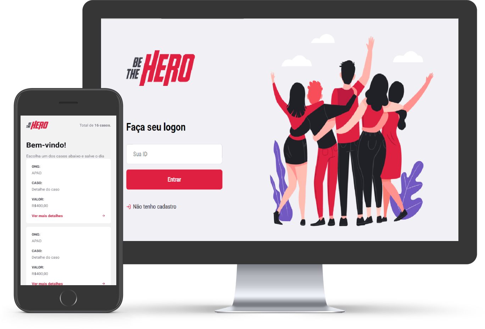

<h1 align="center">
    
</h1>

 

 

> Status do Projeto: Concluido :heavy_check_mark:

 

## :cat: Descrição 

O Be The Hero é um projeto de contribuições monetárias que conecta pessoas com ONG's que precisam de ajuda, esse projeto foi desenvolvido durante a semana Omnistack 11 
ministrado pela [Rocketseat](https://rocketseat.com.br/).

 

### :speech_balloon: Tecnologias 

- React
- Node
- React Native
- Expo

